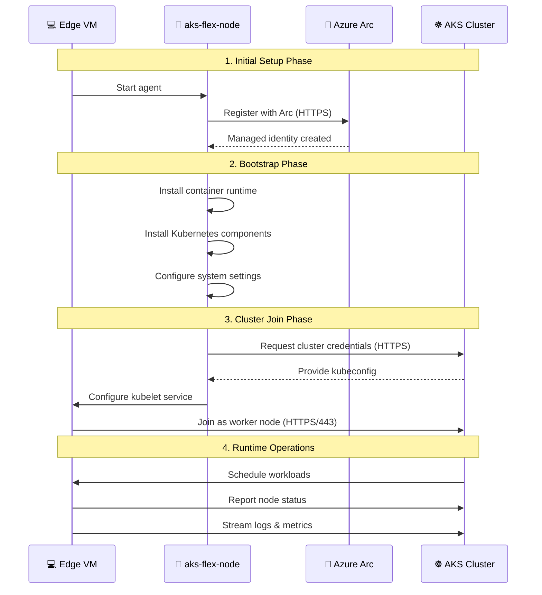

# AKS Flex Node

A Go service that extends Azure Kubernetes Service (AKS) to non-Azure VMs through Azure Arc integration, enabling hybrid and edge computing scenarios.

**Status:** Work In Progress
**Platform:** Ubuntu 22.04.5 LTS (tested)
**Architecture:** x86_64 (amd64)

## Overview

AKS Flex Node transforms any Ubuntu VM into a fully managed AKS worker node by:

- 🔗 **Azure Arc Registration** - Registers your VM with Azure Arc for cloud management
- 📦 **Container Runtime Setup** - Installs and configures runc and containerd
- ☸️ **Kubernetes Integration** - Deploys kubelet, kubectl, and kubeadm components
- 🌐 **Network Configuration** - Sets up Container Network Interface (CNI) for pod networking
- 🚀 **Service Orchestration** - Configures and manages all required systemd services
- ⚡ **Cluster Connection** - Securely joins your VM as a worker node to your existing AKS cluster

## Data Flow



## Quick Start

### Prerequisites
- **VM Requirements:**
  - Ubuntu 22.04.5 LTS VM (non-Azure)
  - Minimum 2GB RAM, 25GB free disk space
  - Sudo access on the VM
- **AKS Cluster Requirements:**
  - Azure RBAC enabled AKS cluster
  - Network connectivity from edge VM to cluster API server (port 443)
- **Azure Authentication & Permissions:**
  - The user account or service principal needs the following permissions:
    - **Arc Registration:** `Azure Connected Machine Onboarding` role on the resource group
    - **RBAC Assignment:** `User Access Administrator` or `Owner` role on the AKS cluster to assign roles to the Arc managed identity
    - **AKS Access:** `Azure Kubernetes Service Cluster Admin Role` on the target AKS cluster

### 1. Installation

```bash
# Install aks-flex-node
curl -fsSL https://raw.githubusercontent.com/Azure/AKSFlexNode/main/scripts/install.sh | sudo bash

# Verify installation
aks-flex-node version
```

### 2. Configure
Create the configuration directory and file:

```bash
# Create configuration file
sudo tee /etc/aks-flex-node/config.json > /dev/null << 'EOF'
{
  "azure": {
    "subscriptionId": "your-subscription-id",
    "tenantId": "your-tenant-id",
    "cloud": "AzurePublicCloud",
    "arc": {
      "machineName": "your-unique-node-name",
      "tags": {
        "environment": "edge",
        "node-type": "worker"
      },
      "resourceGroup": "your-resource-group",
      "location": "westus",
      "autoRoleAssignment": true
    },
    "targetCluster": {
      "resourceId": "/subscriptions/your-subscription-id/resourceGroups/your-rg/providers/Microsoft.ContainerService/managedClusters/your-cluster",
      "location": "westus"
    }
  },
  "agent": {
    "logLevel": "info",
    "logDir": "/var/log/aks-flex-node"
  }
}
EOF

```

**Important:** Replace the placeholder values with your actual Azure resource information:
- `your-subscription-id`: Your Azure subscription ID
- `your-tenant-id`: Your Azure tenant ID
- `your-unique-node-name`: A unique name for this edge node
- `your-resource-group`: Resource group where Arc machine and AKS cluster are located
- `your-cluster`: Your AKS cluster name


### 3. Usage

#### Available Commands

| Command | Description | Usage |
|---------|-------------|-------|
| `bootstrap` | Transform VM into AKS node | `sudo aks-flex-node bootstrap` |
| `unbootstrap` | Clean removal of all components | `sudo aks-flex-node unbootstrap` |
| `version` | Show version information | `sudo aks-flex-node version` |

#### Bootstrap
```bash
# Option 1: Direct command execution
aks-flex-node bootstrap
cat /var/log/aks-flex-node/aks-flex-node.log

# Option 2: Using systemd service
sudo systemctl enable aks-flex-node@bootstrap.service; sudo systemctl start aks-flex-node@bootstrap
journalctl -u aks-flex-node@bootstrap --since "1 minutes ago" -f

```

#### Unbootstrap
```bash
# Option 1: Direct command execution
aks-flex-node unbootstrap
cat /var/log/aks-flex-node/aks-flex-node.log

# Option 2: Using systemd service
sudo systemctl enable aks-flex-node@unbootstrap.service; sudo systemctl start aks-flex-node@unbootstrap
journalctl -u aks-flex-node@unbootstrap --since "1 minutes ago" -f

```

## Authentication Flow:

### CLI Credential:
When Service Pinciple isn't configured, the service will use az login credential for arc related operations, e.g. joining the VM to Azure as an ARC machine. If you haven't run `az login` or your token is expired, the bootstrap process will automatically prompt you to login interactively
- The login prompt will appear in your terminal with device code authentication when needed
- Once authenticated, the service will use your Azure CLI credentials for operations like arc join and role assignments

### Service Principle:
Alternatively, configure a service principal by adding the following to the config file:
```json
{
  "azure": {
    "subscriptionId": "your-subscription-id",
    "tenantId": "your-tenant-id",
    "servicePrincipal": {
      "clientId": "your-service-principal-client-id",
      "clientSecret": "your-service-principal-client-secret"
    },
    // ... rest of config
  }
}
```

The service principal must have the same permissions listed in the Prerequisites section:
- `Azure Connected Machine Onboarding` role on the resource group
- `User Access Administrator` or `Owner` role on the AKS cluster
- `Azure Kubernetes Service Cluster Admin Role` on the target AKS cluster

## Uninstallation

### Complete Removal
```bash
# First run unbootstrap to cleanly disconnect from Arc and AKS cluster
aks-flex-node unbootstrap

# Then run automated uninstall to remove all components
curl -fsSL https://raw.githubusercontent.com/Azure/AKSFlexNode/main/scripts/uninstall.sh | sudo bash
```

The uninstall script will:
- Stop and disable aks-flex-node systemd services (bootstrap/unbootstrap)
- Remove the service user and permissions
- Clean up all directories and configuration files
- Remove the binary and systemd service files

### Force Uninstall (Non-interactive)
```bash
# For automated environments where confirmation prompts should be skipped
curl -fsSL https://raw.githubusercontent.com/Azure/AKSFlexNode/main/scripts/uninstall.sh | sudo bash -s -- --force
```

**⚠️ Important Notes:**
- Run `aks-flex-node unbootstrap` first to properly disconnect from Arc and clean up Azure resources
- The uninstall script will NOT disconnect from Arc - this ensures proper cleanup order
- The Azure Arc agent remains installed but can be removed manually if not needed
- Backup any important data before uninstalling

## Building from Source

For developers who want to build from source:

```bash
# Build the application
make build

# Run tests
make test
```

For a complete list of build targets, run `make help`.

## System Requirements

- **Operating System:** Ubuntu 22.04.5 LTS
- **Architecture:** x86_64 (amd64)
- **Memory:** Minimum 2GB RAM (4GB recommended)
- **Storage:**
  - **Minimum:** 25GB free space
  - **Recommended:** 40GB free space
  - **Production:** 50GB+ free space
- **Network:** Internet connectivity to Azure endpoints
- **Privileges:** Root/sudo access required
- **Build Dependencies:** Go 1.24+ (if building from source)

### Storage Breakdown
- **Base components:** ~3GB (Arc agent, runc, containerd, Kubernetes binaries, CNI plugins)
- **System directories:** ~5-10GB (`/var/lib/containerd`, `/var/lib/kubelet`, configurations)
- **Container images:** ~5-15GB (pause container, system images, workload images)
- **Logs:** ~2-5GB (`/var/log/pods`, `/var/log/containers`, agent logs)
- **Installation buffer:** ~5-10GB (temporary downloads, garbage collection headroom)


## Documentation [TO BE ADDED]

- [Development Guide](docs/DEVELOPMENT.md)
- [Configuration Reference](docs/CONFIGURATION.md)
- [Setup Guide](docs/AKS_EDGE_NODE_SETUP_GUIDE.md)
- [Troubleshooting](docs/TROUBLESHOOTING.md)
- [APT Packaging](docs/APT_PACKAGING_GUIDE.md)

## Contributing

1. Fork the repository
2. Create your feature branch (`git checkout -b feature/amazing-feature`)
3. Commit your changes (`git commit -m 'Add amazing feature'`)
4. Push to the branch (`git push origin feature/amazing-feature`)
5. Open a Pull Request

## License

This project is licensed under the MIT License - see the [LICENSE](LICENSE) file for details.

## Support

- Report issues: [GitHub Issues](https://github.com/your-org/AKSFlexNode/issues)
- Discussion: [GitHub Discussions](https://github.com/your-org/AKSFlexNode/discussions)
- Email: support@yourorg.com

---

<div align="center">

**🚀 Built with ❤️ for the Kubernetes community**


</div>